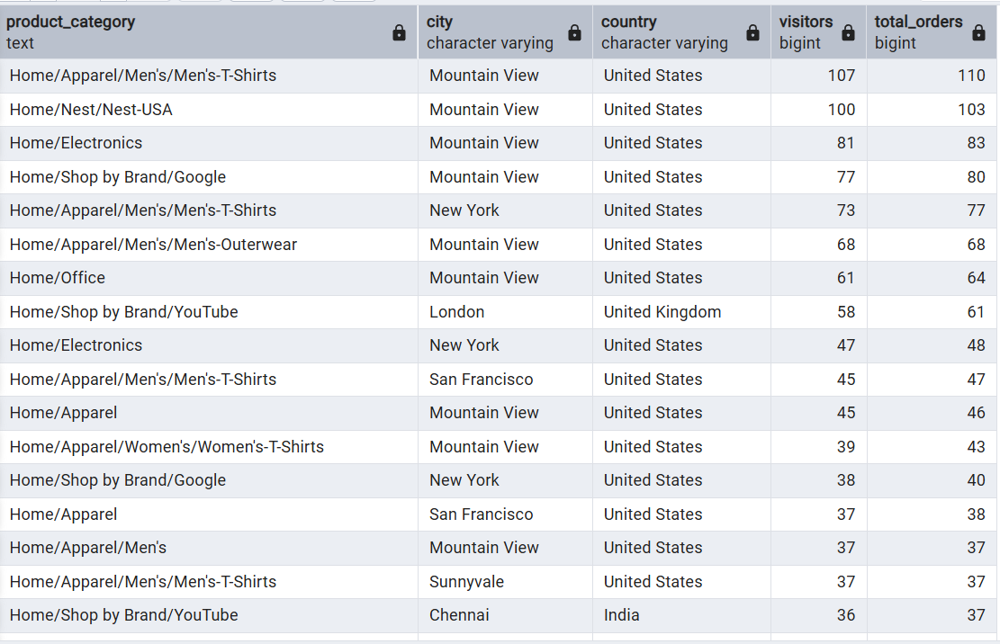

# Starting with Questions
---
    
## Question 1
> Which cities and countries have the highest level of transaction revenues on the site?


```sql
SELECT
		fullvisitorid,
		city,
		country,
		round (avg(orderedquantity), 2) AS avg_product,
		CASE WHEN city = 'london' THEN 'United Kingdom'
		END AS cleaned_city
FROM products
JOIN all_sessions ON products.productsku = all_sessions.productsku
WHERE city NOT LIKE '%not available in demo dataset%' AND city NOT LIKE '%(not set)%'
GROUP BY fullvisitorid, city, country
ORDER BY fullvisitorid DESC
'''

### :heavy_check_mark: Answer


## Question 2
> What is the average number of products ordered from visitors in each city and country?


```sql
SELECT
		city,
		country,
		round (avg(orderedquantity), 2) AS avg_product
FROM (
		SELECT
			productsku,
			fullvisitorid,
			city,
			country
		FROM all_sessions 
		) AS visit
JOIN products ON visit.productsku = products.productsku
WHERE
		city IS NOT NULL
		AND country IS NOT NULL
		AND city NOT ILIKE '%not available in demo dataset%'
		AND city NOT ILIKE '%(not set)%'
GROUP BY city, country
```


### :heavy_check_mark: Answer


## Question 3
> Is there any pattern in the types (product categories) of products ordered from visitors in each city and country?

```sql
SELECT
	REGEXP_REPLACE(v2productcategory, '/$', '') AS product_category,
	city,
	country,
	COUNT(DISTINCT fullvisitorid) AS visitors,
	COUNT(productsku) AS total_orders
FROM all_sessions
WHERE
    city IS NOT NULL
    AND country IS NOT NULL
    AND city NOT ILIKE '%not available in demo dataset%'
    AND city NOT ILIKE '%(not set)%'
	AND v2productcategory NOT ILIKE '%(not set)%'
GROUP BY
	product_category,
	all_sessions.city,
	all_sessions.country
ORDER BY
    total_orders DESC
```


### :heavy_check_mark: Answer

### :heavy_check_mark: Answer



## Question 4
> What is the top-selling product from each city/country? Can we find any pattern worthy of noting in the products sold?

```sql
SELECT
		v2productname AS productname,
		city,
		country,
		sum(productrevenue/1000000) AS revenue,
		RANK () OVER (PARTITION BY country, city ORDER BY sum(productrevenue) DESC) AS top_sellers
	FROM all_sessions
	WHERE city IS NOT NULL
	AND country IS NOT NULL
	AND productrevenue IS NOT NULL AND v2productname IS NOT NULL
	GROUP BY 
		productname,
		city,
		country
	ORDER BY top_sellers
```

### :heavy_check_mark: Answer


## Question 5
> Can we summarize the impact of revenue generated from each city/country?

```sql
SELECT
	COUNT(*) AS summary,
	sum (unitprice/1000000 * unitsold :: numeric) AS revenue,
	city,
	country
FROM analytics
FULL OUTER JOIN all_sessions ON analytics.visitid :: numeric = all_sessions.visitid
WHERE 
	city IS NOT NULL
	AND country IS NOT NULL
	AND revenue IS NOT NULL
GROUP BY city, country
ORDER BY revenue DESC
```

### :heavy_check_mark: Answer


